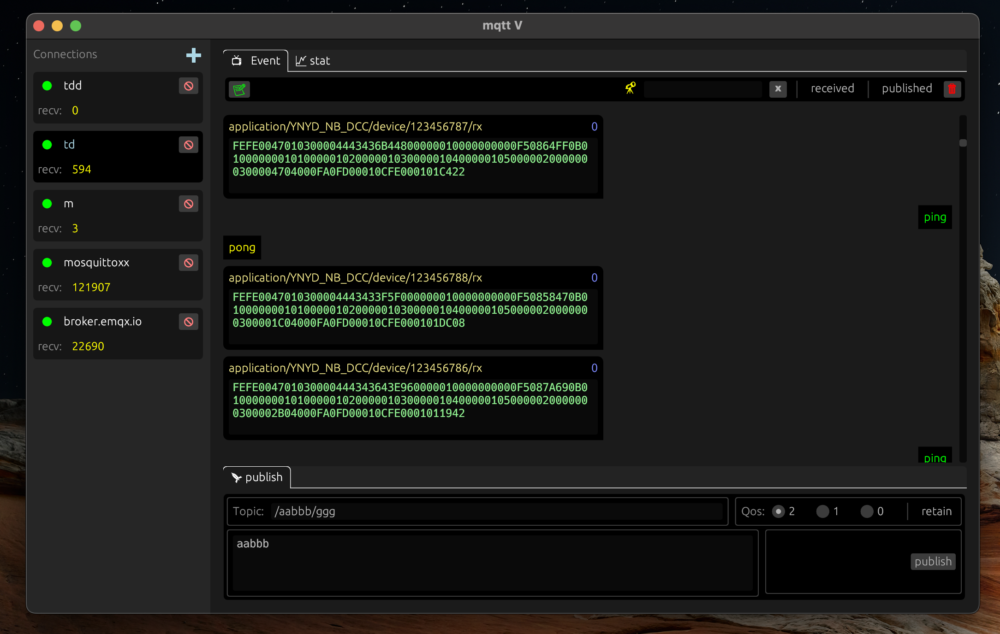

#   mqttV:   mqtt client GUI in rust

GUI library  [egui](https://github.com/emilk/egui)

Backend library [rumqttc](https://github.com/bytebeamio/rumqtt/tree/main/rumqttc)

## Goals
* Powerful and easy to use
* Modern and performant UI
* Cross platform with small size executable file
* Statistics and analysis of Data

## Status
work in progress

## Screenshots

  

